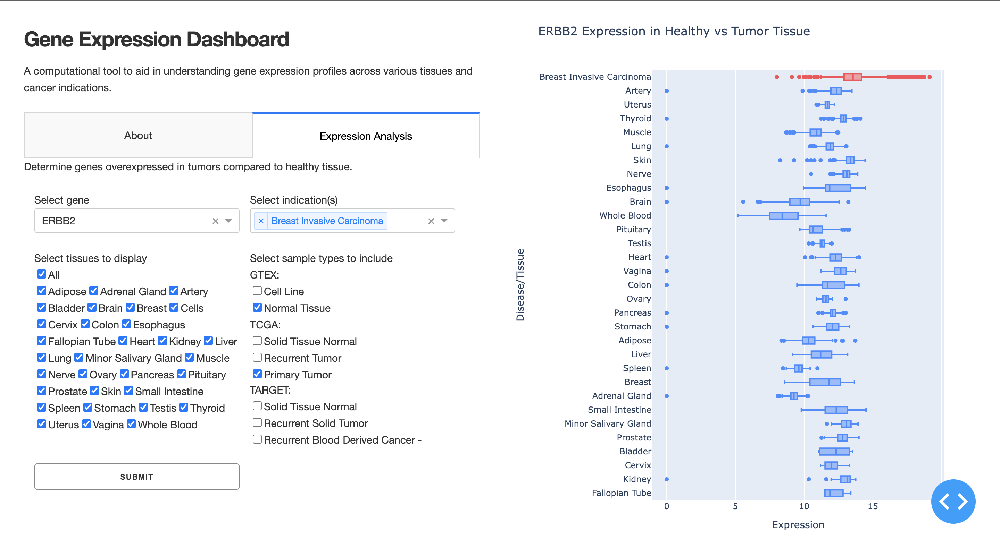

# Gene-Expression-Dashboard

## About this app

This app utilizes Plotly + Dash to create a dashboard displaying interactive gene expression data from the UCSC Toil RNASeq Dataset. Specifically, it allows you to explore which genes are overexpressed in cancer tissue compared to normal tissue. 

## Requirements

* Python 3

## How to run this app

Clone this repository and open your terminal/command prompt in the root folder.

```
git clone https://github.com/josephentner/Gene-Expression-Dashboard.git
cd Gene-Expression-Dashboard
python3 -m virtualenv venv
```

In Unix system:
```
source venv/bin/activate
```

In Windows: 
```
venv\Scripts\activate
```

Install all required packages by running:
```
pip install -r requirements.txt
```

Run this app locally with:
```
python3 app.py
```

## Screenshot



## Resources

* [Dash](https://dash.plot.ly/)
* Style and structure inspired by [Dash Sample App](https://github.com/plotly/dash-sample-apps/tree/main/apps/dash-clinical-analytics).# Gene-Expression-Dashboard
